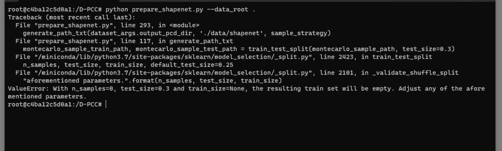

# D-PCC_progress and Stuck Point
We are trying to run [this](https://github.com/yunhe20/D-PCC) repository.
## Main progress    

We have successfully completed the docker environment setup of D-PCC. We have setup this environment only for windows docker engine.

### Docker Environment  setup

To setup the docker environment you can use [this](https://clickspikesktinformatics.sharepoint.com/:fl:/g/contentstorage/CSP_ab030a3d-47c0-4d19-9e1b-682763136853/EZhYvOIYq5VFuNLP8GyTwNkBN7vsvKtukOUCKn5_b3h4vA?e=paN65f&nav=cz0lMkZjb250ZW50c3RvcmFnZSUyRkNTUF9hYjAzMGEzZC00N2MwLTRkMTktOWUxYi02ODI3NjMxMzY4NTMmZD1iIVBRb0RxOEJIR1UyZUcyZ25ZeE5vVThwbEhCbmVGMkpIaTBndDRCNWowZUpPQ3laYkNKMDRSWlhuOEdqMjhPcDAmZj0wMVZVNEdJTkVZTEM2T0VHRkxTVkMzUlVXUDZCV0pIUUdaJmM9JTJGJmZsdWlkPTEmYT1Mb29wQXBwJnA9JTQwZmx1aWR4JTJGbG9vcC1wYWdlLWNvbnRhaW5lciZ4PSU3QiUyMnclMjIlM0ElMjJUMFJUVUh4amJHbGphM053YVd0bGMydDBhVzVtYjNKdFlYUnBZM011YzJoaGNtVndiMmx1ZEM1amIyMThZaUZRVVc5RWNUaENTRWRWTW1WSE1tZHVXWGhPYjFVNGNHeElRbTVsUmpKS1NHa3daM1EwUWpWcU1HVktUME41V21KRFNqQTBVbHBZYmpoSGFqSTRUM0F3ZkRBeFZsVTBSMGxPU0ZCWlN6VlhSME5GU1RkR1FVeEVVRVJEUmxSR1JWTlhTRWclM0QlMjIlMkMlMjJpJTIyJTNBJTIyZWQ4NzkzZDktZjEzYS00MWVjLTgxNzktNTlhODU2MDhiOTIyJTIyJTdE) tutorial.

This is the **dockerfile**
``` 
# Start from Ubuntu 16.04 with CUDA
FROM nvidia/cuda:11.0.3-runtime-ubuntu16.04

# Make sure the image is updated, install some prerequisites
RUN apt-get update && apt-get install -y sudo wget

# Install miniconda
RUN wget https://repo.anaconda.com/miniconda/Miniconda3-py37_22.11.1-1-Linux-x86_64.sh -O ~/miniconda.sh && \
    bash ~/miniconda.sh -b -p /miniconda && \
    rm ~/miniconda.sh
ENV PATH="/miniconda/bin:${PATH}"

# Install PyTorch 1.7.1
RUN conda install pytorch==1.7.1 torchvision==0.8.2 torchaudio==0.7.2 cudatoolkit=11.0 -c pytorch

RUN sudo apt-get update
RUN pip install numpy==1.20.3
RUN pip install open3d==0.9.0.0
RUN pip install einops==0.3.2
RUN pip install scikit-learn==1.0.1
RUN pip install compressai
RUN pip install argparse
# RUN sudo apt install cmake
# RUN sudo apt-get install g++
# RUN export CXX=/usr/bin/g++
# RUN sudo apt-get install libgl1-mesa-glx -y
COPY D-PCC /D-PCC
```

And this is the **docker-compose.yml** file
```
version: '3'
services:
  ubuntu:
    build: .
    volumes:
      - ./D-PCC:/D-PCC
    command: tail -f /dev/null
    deploy:
      resources:
        reservations:
          devices:
          - driver: nvidia
            count: all
            capabilities: [gpu]
```
Now you can run **docker compose up** and access the GPU in docker container.

## Stuck Point

We have stuck at the point where we are trying to run the **data preparation step**.   
When we run **python prepare_shapenet.py --date_root path/to/shapenet** it shows:


